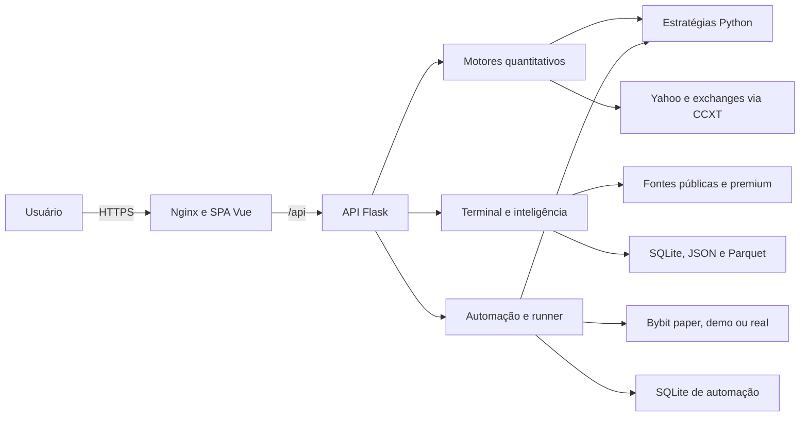
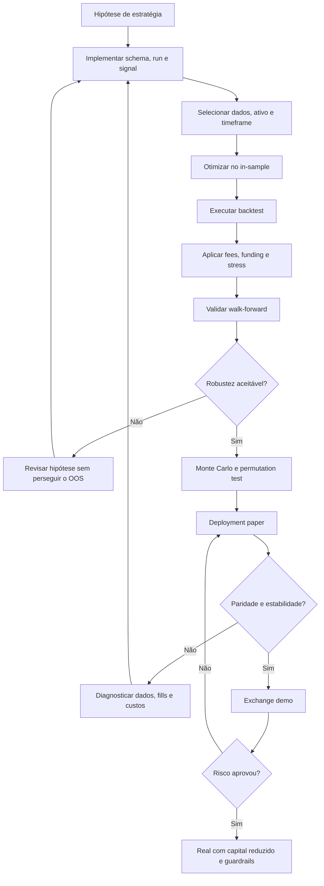
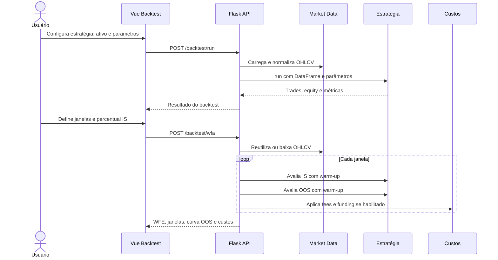
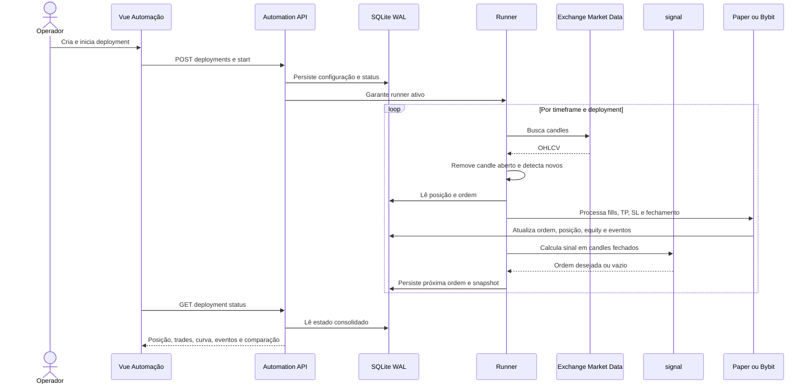
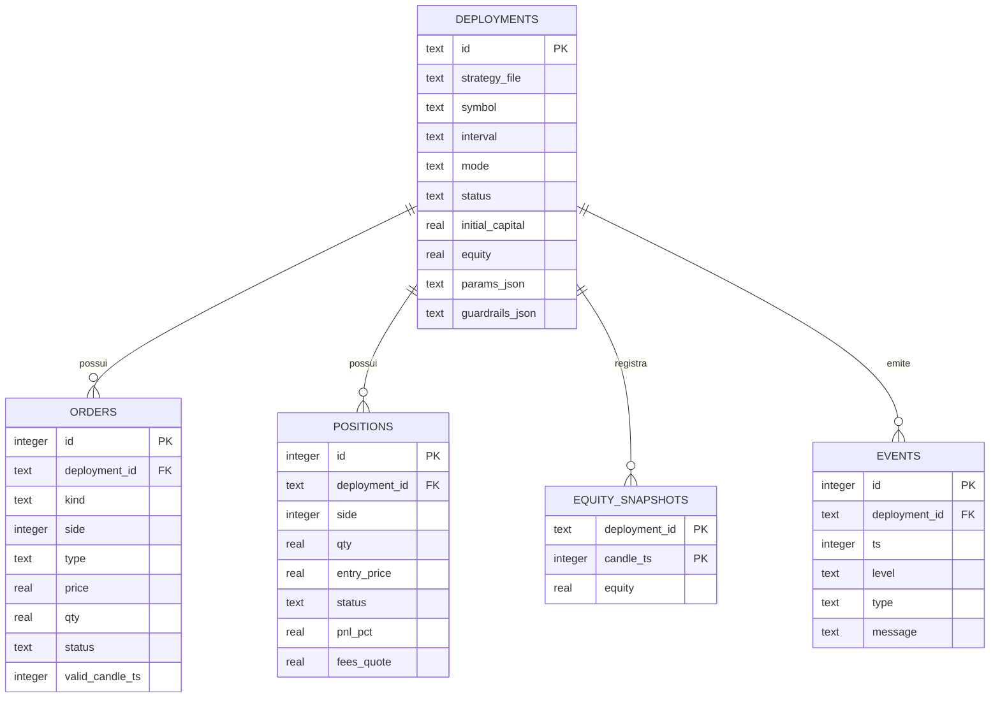
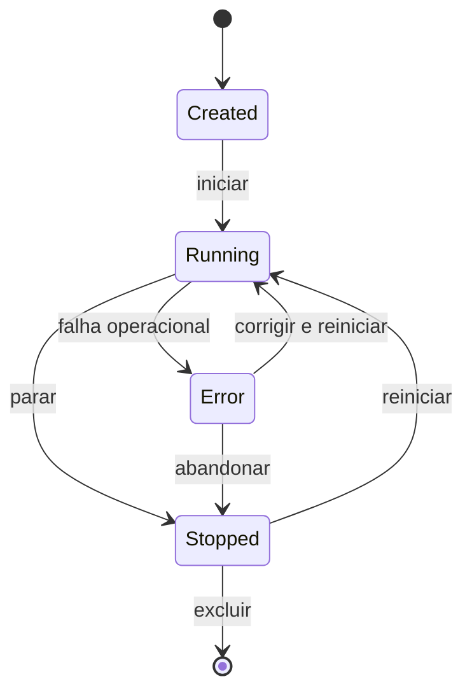

# Diagramas do projeto

Os diagramas abaixo usam Mermaid e podem ser renderizados no GitHub, editores compatíveis ou importados em ferramentas de diagramação. Eles refletem o código atual, não a arquitetura futura desejada.

## 1. Arquitetura de containers e integrações

## 2. Jornada de validação de estratégia

## 3. Sequência do backtest e WFA

## 4. Sequência da automação

## 5. Modelo de dados da automação

## 6. Estados de deployment

## 7. Mapa de domínios

```mermaid
flowchart TB
    workspace["Workspace compartilhado"] --> strategyDomain["Estratégia"]
    workspace --> marketDomain["Mercados"]
    workspace --> analysisDomain["Análise"]
    workspace --> executionDomain["Execução"]
    strategyDomain --> backtest["Backtest e custos"]
    strategyDomain --> optimizer["Otimizador"]
    strategyDomain --> validation["WFA e Monte Carlo"]
    strategyDomain --> prop["Prop Challenge"]
    marketDomain --> monitoring["Monitor e screener"]
    marketDomain --> charts["Gráficos e técnica"]
    marketDomain --> intelligence["Inteligência e eventos"]
    analysisDomain --> fundamental["Empresas e screening"]
    analysisDomain --> macro["Juros e commodities"]
    analysisDomain --> alternatives["Alt data e on-chain"]
    executionDomain --> oms["OMS"]
    executionDomain --> auto["Automação"]
    executionDomain --> journal["Diário"]
    executionDomain --> agents["Agentes e HFT"]
```

## 8. Diagramas futuros recomendados

- Arquitetura alvo com API, workers, runner, PostgreSQL, Redis e observabilidade.
- Data lineage por fonte, cache, transformação, endpoint e tela.
- Threat model para execução real e gestão de segredos.
- Sequência detalhada de reconciliação com exchange.
- State machine de ordem e posição por modo.
- Matriz estratégia × suporte a backtest/optimizer/signal/Pine.
- Fluxo de incidente e kill switch.

